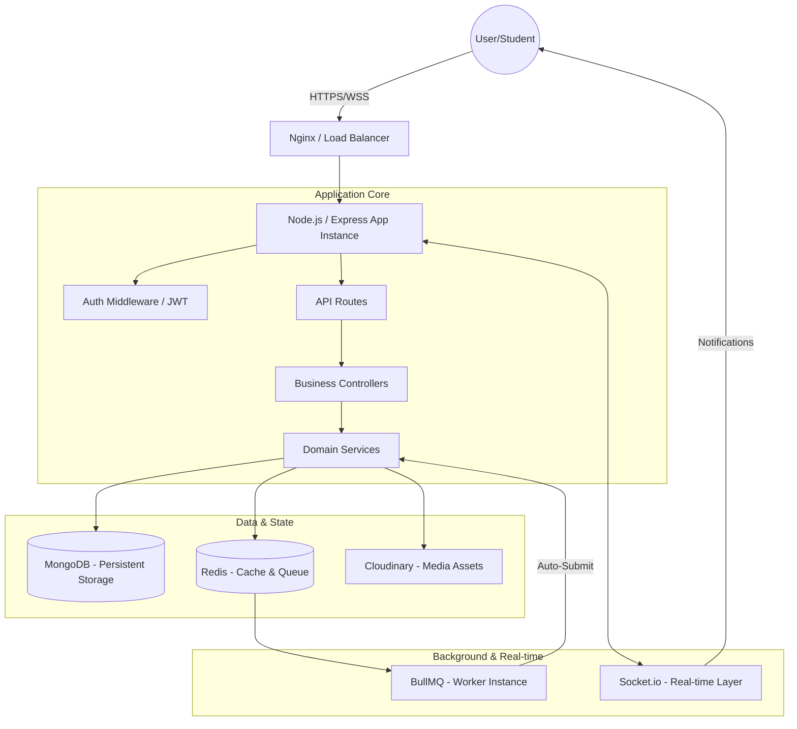

<div align="center">
  

  # TESTFLOW: The Enterprise-Grade Assessment Engine 🚀
  
  **A High-Performance, Multi-Tenant SaaS Platform for Secure, Real-Time Digital Evaluations.**

  [](https://reactjs.org/)
  [](https://nodejs.org/)
  [](https://mongodb.com/)
  [](https://redis.io/)
  [](https://socket.io/)
  [](https://tailwindcss.com/)
</div>

---

## 📖 Table of Contents
1. [🌟 System Overview](#-system-overview)
2. [🏗️ System Architecture](#️-system-architecture)
3. [👤 Detailed User Journeys & Portal Workflows](#-detailed-user-journeys--portal-workflows)
4. [⚙️ Technical Deep-Dive: Backend Architecture](#️-technical-deep-dive-backend-architecture)
5. [🎨 Technical Deep-Dive: Frontend Architecture](#-technical-deep-dive-frontend-architecture)
6. [💎 Pin-Point Production Features](#-pin-point-production-features)
7. [🛡️ Security Hardening & Scale](#️-security-hardening--scale)
8. [📂 Project Structure & Module Breakdown](#-project-structure--module-breakdown)
9. [🚀 API Documentation Reference](#-api-documentation-reference)
10. [🛠️ Local Installation & Configuration](#️-local-installation--configuration)

---

## 🌟 System Overview
**TESTFLOW** is not just an online test portal; it is a full-lifecycle examination management system designed to handle the complexities of institutional scale. It manages everything from **automated question ingestion** via AI/PDF parsing to **live proctored execution** and **deep data analytics**.

The platform is architected around the **"Zero-Trust"** principle for examinations, ensuring that once a test begins, it is strictly monitored and forcibly submitted by the backend should the user attempt to circumvent the time limits.

---

## 🏗️ System Architecture

### 1. High-Level Logic Diagram
The system follows a distributed architecture where the core Node.js server acts as an orchestrator between the stateful database, fast-access cache/queue, and the real-time socket layer.



### 2. Request Lifecycle & Security Layers
Every request entering the system passes through a multi-stage defensive perimeter before touching the domain logic.

1.  **Transport Layer**: SSL/TLS encryption for all data in transit.
2.  **Network Layer**: `Express-Rate-Limit` blocks brute-force and DDoS patterns.
3.  **Header Layer**: `Helmet.js` secures HTTP headers (XSS, Clickjacking, etc.).
4.  **Authentication Layer**: Stateless JWT validation checks for token integrity and expiration.
5.  **Authorization Layer (RBAC)**: Custom middleware verifies if the user role has the required granular permission (e.g., `create_test`).
6.  **Validation Layer**: `Express-Validator` and `Joi` sanitize and validate incoming payloads against strict schemas.

### 3. Real-Time Sync & Background Jobs
*   **Socket.io Rooms**: Users are automatically joined to rooms based on their `InstitutionId` and `UserId`. This allows for targeted broadcasting of test publications and live result updates.
*   **Delayed Job Execution**: When a test starts, a non-blocking job is queued in Redis. This ensures that even if the server is under extreme load or restarts, the student's test integrity is preserved by the external worker.

---

## 👤 Detailed User Journeys & Portal Workflows

### 1️⃣ Super Admin Journey (Infrastructure Tier)
*   **Access:** High-security login via dedicated admin credentials.
*   **Key Workflows:**
    *   **Tenant Provisioning:** Dynamically register and onboard new Institutions (Colleges, Organizations).
    *   **Global User Audit:** Monitor every user across all institutions, with the ability to suspend/delete accounts platform-wide.
    *   **Health Monitoring:** View a unified dashboard of global metrics: total active tests, total students, and system logs.
    *   **Platform Governance:** Toggle the `isActive` state of entire organizations to manage subscription tiers or violations.

### 2️⃣ Institution Admin Journey (Organization Tier)
*   **Access:** Secure OTP-based verification for institutional owners.
*   **Key Workflows:**
    *   **Staffing:** Onboard and manage **Instructors** and **Students** specifically for their organization.
    *   **Organization Analytics:** View aggregated performance data exclusive to their institution.
    *   **Test Supervision:** Oversight of all tests created by their staff, ensuring quality and alignment with curriculum.
    *   **Account Controls:** Reset student attempts or manage instructor permissions within the local scope.

### 3️⃣ Instructor Journey (Content & Evaluation Tier)
*   **Access:** Role-restricted portal for educators.
*   **Key Workflows:**
    *   **Smart Test Engine:** Create assessments manually or use the **PDF Parsing Engine** to extract MCQ sets from existing documents instantly.
    *   **Question Bank Management:** Sophisticated interface for managing MCQ metadata (marks, difficulty, correct options).
    *   **Lifecycle Management:** Move tests from `Draft` to `Published`. Once published, tests are immutable for participants.
    *   **Live Analytics:** Real-time monitoring of student submissions and pass/fail distributions using interactive Recharts.

### 4️⃣ Student Journey (Participant Tier)
*   **Access:** Streamlined dashboard focused on current and upcoming assessments.
*   **Key Workflows:**
    *   **Test Execution:** A focus-locked UI for taking exams. Integrated with **Socket.io** for real-time heartbeat sync.
    *   **The "Timer Lock":** Even if the browser is closed, the backend **BullMQ** job ensures the test is submitted at the exact deadline.
    *   **Performance Tracking:** Detailed result breakdowns showing scores, average performance, and rank.
    *   **Leaderboards:** A premium, medal-based rank system for healthy competition within the student body.

---

## ⚙️ Technical Deep-Dive: Backend Architecture

### Core Engine (Node.js & Express)
Built with a modular **Service-Controller-Route** pattern to ensure maintainability and separation of concerns.
*   **Service Layer:** Handles heavy lifting like PDF question extraction, complex scoring logic, and interaction with BullMQ.
*   **Controller Layer:** Orchestrates request handling, security validation, and response formatting.
*   **Middleware Stack:** Includes RBAC (Role-Based Access Control), JWT validation, and multi-stage error handling.

### Queue Management (Redis & BullMQ)
Crucial for production stability, TESTFLOW offloads time-sensitive tasks to Redis.
*   **Auto-Submission Worker:** When a student starts a test, a delayed job is pushed to BullMQ.
*   **Reliability:** Jobs survive server restarts, ensuring that no test is ever left in an "infinite" state.

### Real-Time Layer (Socket.io)
*   **Namespaced Communication:** Uses separate rooms for different institutions and individual users.
*   **Live Proctors:** Instructors are notified instantly of every submission via the `test:submitted` socket event.

---

## 🎨 Technical Deep-Dive: Frontend Architecture

### State Management & Data Fetching
*   **Zustand:** Used for lightweight global states like Sidebar status and ephemeral UI states.
*   **Context API:** Handles global Authentication and Socket connection states.
*   **TanStack Query (v5):** The backbone of data fetching. Implements automatic caching, background revalidation, and loading state management for a seamless "App-like" feel.

### UI/UX Philosophy
*   **Premium Aesthetics:** A curated HSL-based color palette with deep indigo and violet gradients.
*   **Micro-Animations:** Powered by `framer-motion` for page transitions, modal entrances, and hover effects.
*   **Responsiveness:** A "Desktop-First" approach optimized for the concentration required for examinations, while remaining fully fluid for mobile dashboard checks.

---

## 🛡️ Security Hardening & Scale

### Production Security Measures
*   **Helmet.js:** Implementation of CSP, XSS protection, and frameguard headers.
*   **JWT Rotation:** Short-lived access tokens with secure Refresh Token rotation stored in the DB.
*   **Rate Limiting:** Multi-tiered limits (Auth vs General API) to prevent Brute Force and DDoS attempts.
*   **Bcrypt Hashing:** Passwords are hashed with 10 salt rounds for the optimal balance of security and CPU performance.

### Optimization for 10k+ Concurrent Users
*   **Lean Queries:** Systematic use of `.lean()` in Mongoose to reduce memory footprint by 20-30%.
*   **Non-Blocking Logic:** Offloaded logging (Audit Logs) to background processes.
*   **Consolidated Writes:** Minimized DB round-trips by batching multiple updates (Login reset, Joined time, Token update) into single atomic operations.
*   **Cluster Readiness:** Optimized for PM2 cluster mode with stateless authentication.

---

## 📂 Project Structure & Module Breakdown

### `server/` (The Core Engine)
*   `app/config/`: Connection logic for MongoDB, Redis, and Cloudinary.
*   `app/services/`: **The Brain.** Contains `pdfParser.js` (Regex-based MCQ extraction) and `attempt.service.js` (Scoring and state logic).
*   `app/utils/`: High-performance utilities like `auditLogger.js` (Winston-based logging) and `socket.js` (Real-time events).

### `client/` (The User Interface)
*   `src/api/`: Centralized Axios instance with interceptors for automatic token refresh.
*   `src/components/modals/`: Complex interactive components like `QuestionModal.jsx` for test creation.
*   `src/pages/tests/`: High-stakes UI like `TestPlayer.jsx` designed for maximum stability during exam execution.

---

## 🚀 API Documentation Reference

| Route | Method | Access | Description |
| :--- | :--- | :--- | :--- |
| `/api/auth/login` | POST | Public | Authenticates user and returns JWT pair. |
| `/api/auth/register` | POST | Public | Triggers OTP-based institutional registration. |
| `/api/tests` | GET | Instructor+ | Fetches tests filtered by institution and status. |
| `/api/tests/upload-pdf` | POST | Instructor | **Intelligent Parser** - Creates test from PDF MCQ file. |
| `/api/attempts/start` | POST | Student | Initializes test attempt and starts BullMQ timer. |
| `/api/attempts/submit` | POST | Student | Finalizes scoring and marks attempt as complete. |
| `/api/admin/metrics` | GET | SuperAdmin | Returns global platform health statistics. |

---

## 🛠️ Local Installation & Configuration

### Prerequisites
*   Node.js (v18+)
*   MongoDB Instance
*   Redis Instance (Running on default port 6379)
*   Cloudinary Account (For profile images)

### 1. Server Configuration
```bash
cd server
npm install
# Create .env and populate:
PORT=3006
MONGO_URI=mongodb://...
REDIS_URL=redis://localhost:6379
JWT_ACCESS_SECRET=...
JWT_REFRESH_SECRET=...
CLOUDINARY_CLOUD_NAME=...
```

### 2. Client Configuration
```bash
cd client
npm install
# Create .env and populate:
VITE_API_URL=http://localhost:3006/api
VITE_SOCKET_URL=http://localhost:3006
```

---

<div align="center">
  <p><b>TESTFLOW</b>: Engineered for Integrity, Built for Scale.</p>
  <p>Developed by <b>Subhradeep Nath</b></p>
</div>
