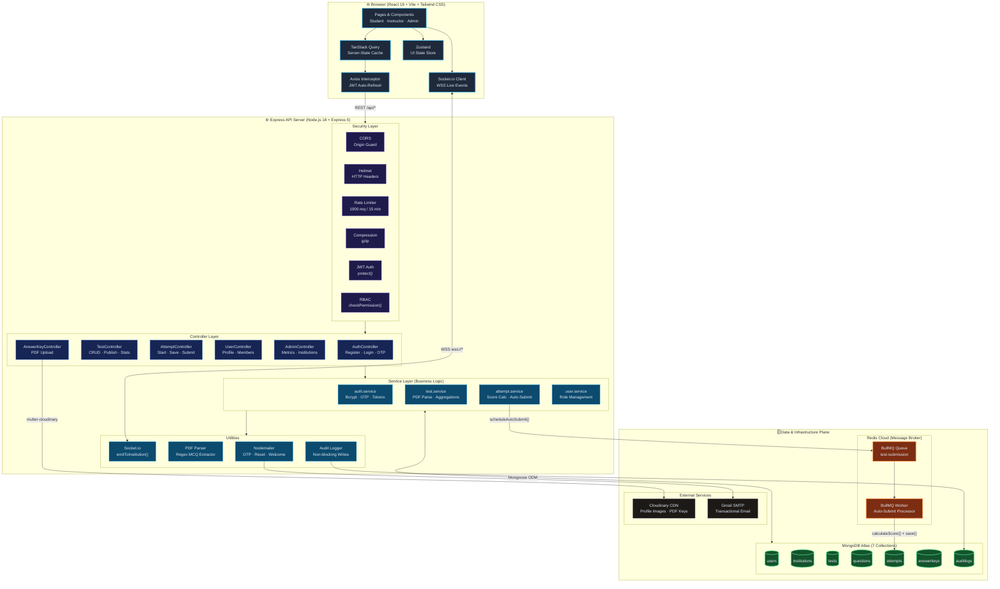

<div align="center">


  # TESTFLOW
  
  **Enterprise-Grade Online Assessment & Examination Platform**

  [](https://reactjs.org/)
  [](https://nodejs.org/)
  [](https://www.mongodb.com/)
  [](https://redis.io/)
  [](http://localhost:3006/api-docs)
</div>

<br />

## 📖 Overview

**TESTFLOW** is a highly scalable, multi-tenant assessment platform engineered to handle massive concurrent traffic for educational institutions and corporate environments. It transcends traditional CRUD applications by implementing complex distributed systems patterns, real-time bidirectional communication, and automated background processing.

Whether it's parsing unstructured PDFs into structured MCQs using AI/Regex or managing asynchronous test auto-submissions via distributed Redis queues, this platform is built to production-grade standards.

---

## 🏗️ System Architecture



---

## ⚙️ Core Workflows & Engineering Optimizations

### 1. Resilient Test Auto-Submission (Distributed Queues)
**The Problem:** If a student's internet drops or they close their browser, their test timer expires, but the server never receives a "submit" request, leaving the test in a hanging state.
**The TESTFLOW Solution:**
- When a student starts an attempt, the `AttemptService` calculates the exact expiry timestamp.
- It pushes a delayed job to a **Redis Queue** using `BullMQ`.
- A standalone `worker.js` listens to this queue. If the time expires and the test isn't manually submitted, the worker independently calculates the score based on saved answers and marks it as `AUTO_SUBMITTED` directly in MongoDB.
- If the student submits manually *before* the time runs out, the API securely cancels the pending Redis job.

### 2. Automated Test Generation via PDF Parsing
**Workflow:**
- Instructors upload a standard question paper PDF.
- The `PDFParser` utility utilizes `pdf-parse` (with `tesseract.js` fallback hooks) to extract raw text.
- Complex Regular Expressions isolate the Question Text, Options (A-E), and the Correct Answer Key.
- The backend automatically calculates total marks, bundles the questions, and constructs a relational test entity in MongoDB.

### 3. Real-Time Dashboard Synchronization
**Workflow:**
- `Socket.io` is implemented with strict authentication and namespacing by `institutionId`.
- When an event occurs (e.g., a student starts a test, or an instructor publishes an answer key), the backend emits localized events.
- The React frontend captures these events and forcefully invalidates specific `TanStack Query` caches, triggering silent, instant background refetches. Result: Zero-reload, live-updating dashboards.

---

## 🛡️ Security & RBAC Implementation

Security is handled at both the gateway and controller levels.

1.  **Stateless Authentication:** Short-lived JWT Access Tokens combined with long-lived, securely stored Refresh Tokens prevent session hijacking.
2.  **Hierarchical RBAC Matrix:** 
    - `Super Admin`: Platform-wide metrics and institution suspension.
    - `Owner`: Institution-level control (add/remove students/instructors).
    - `Instructor`: Test creation, PDF uploading, analytics viewing.
    - `Student`: Read-only access to published tests and personal results.
3.  **Audit Logging:** Every critical action (Login, Delete, Update) triggers a non-blocking asynchronous database write to the `AuditLog` collection, tracking IP, User Agent, and Target IDs.

---

## 📂 Detailed Codebase Topography

<details>
<summary><b>Frontend Structure (React/Vite)</b></summary>

```text
client/src/
├── api/                # Axios interceptors (auto token refresh) & modular API hooks
├── components/         # Atomic UI components
│   ├── auth/           # RBAC Protected Route wrappers
│   ├── common/         # SearchBars, Pagination, ErrorBoundaries, Skeletons
│   └── modals/         # Confirmation & Profile Modals
├── context/            # Socket.io connection & Auth lifecycle providers
├── layouts/            # Dashboard layouts with responsive sidebars
├── pages/              
│   ├── admin/          # Super Admin & Institution Owner management panels
│   ├── dashboard/      # Instructor Analytics & Archival pages
│   └── tests/          # The core TestPlayer engine & Live Leaderboards
├── routes/             # Centralized routing logic
└── store/              # Zustand global state (Sidebar toggle, etc.)
```
</details>

<details>
<summary><b>Backend Structure (Node/Express)</b></summary>

```text
server/app/
├── config/             # DB, Redis, BullMQ Worker initialization, and Roles JSON
├── controllers/        # Request parsing and response formatting
├── middleware/         # Security (Helmet, Rate Limiter), Auth (JWT), Multer (File uploads)
├── models/             # Mongoose schemas with pre-save hooks (bcrypt)
├── routes/             # Express API route definitions
├── services/           # Heavy lifting (Analytics aggregation, Auto-submit logic)
└── utils/              # PDF Parsing, Socket.io emitters, Nodemailer, Cron Jobs
```
</details>

---

## 💻 Technical Stack

| Domain | Technology | Justification |
| :--- | :--- | :--- |
| **Frontend Framework** | React 19 + Vite | High-performance virtual DOM rendering with instant HMR dev experience. |
| **State & Caching** | Zustand + TanStack Query | Eliminates prop-drilling; Query handles race conditions and stale data automatically. |
| **Styling** | Tailwind CSS v4 | Utility-first, highly maintainable design system without CSS bloat. |
| **Backend Framework** | Node.js + Express 5 | Event-driven I/O model perfect for concurrent test-taking connections. |
| **Primary Database** | MongoDB Atlas | Flexible document model; crucial for complex nested aggregation pipelines (Analytics). |
| **Queue / Cache** | Redis + BullMQ | Highly reliable job scheduling for asynchronous tasks preventing event-loop blocks. |
| **Real-Time Comm.** | Socket.io | Reliable WebSocket fallbacks with built-in broadcasting/room capabilities. |

---

## 🚀 Getting Started

Follow these instructions to spin up the entire architecture locally.

### Prerequisites
- Node.js (v18+)
- Local or Cloud MongoDB Instance
- Local or Cloud Redis Server

### Environment Configuration
Create `.env` files in both `client` and `server` based on their respective `.env.example` templates.

**Crucial Server Variables:**
```env
MONGODB_URL=mongodb://localhost:27017/testflow
REDIS_URL=redis://localhost:6379
JWT_ACCESS_SECRET=your_secret
JWT_REFRESH_SECRET=your_refresh_secret
```

### Installation
1. **Clone the repository**
   ```bash
   git clone https://github.com/SubhradeepNathGit/TESTFLOW.git
   cd TESTFLOW
   ```

2. **Boot the Backend**
   ```bash
   cd server
   npm install
   npm run dev
   ```

3. **Boot the Frontend**
   ```bash
   cd ../client
   npm install
   npm run dev
   ```

---

## 📖 API Documentation (Swagger)

The backend exposes an interactive **Swagger UI** containing schemas, endpoints, and authentication flows.
With the server running, access the docs at:  
👉 **[http://localhost:3006/api-docs](http://localhost:3006/api-docs)**

---

## 📄 License & Contact

This project is licensed under the ISC License.

<div align="center">
  <b>Architected & Developed by <a href="https://github.com/SubhradeepNathGit">Subhradeep Nath</a></b><br/>
  <i>Open to Full-Stack Software Engineering Opportunities</i>
</div>
